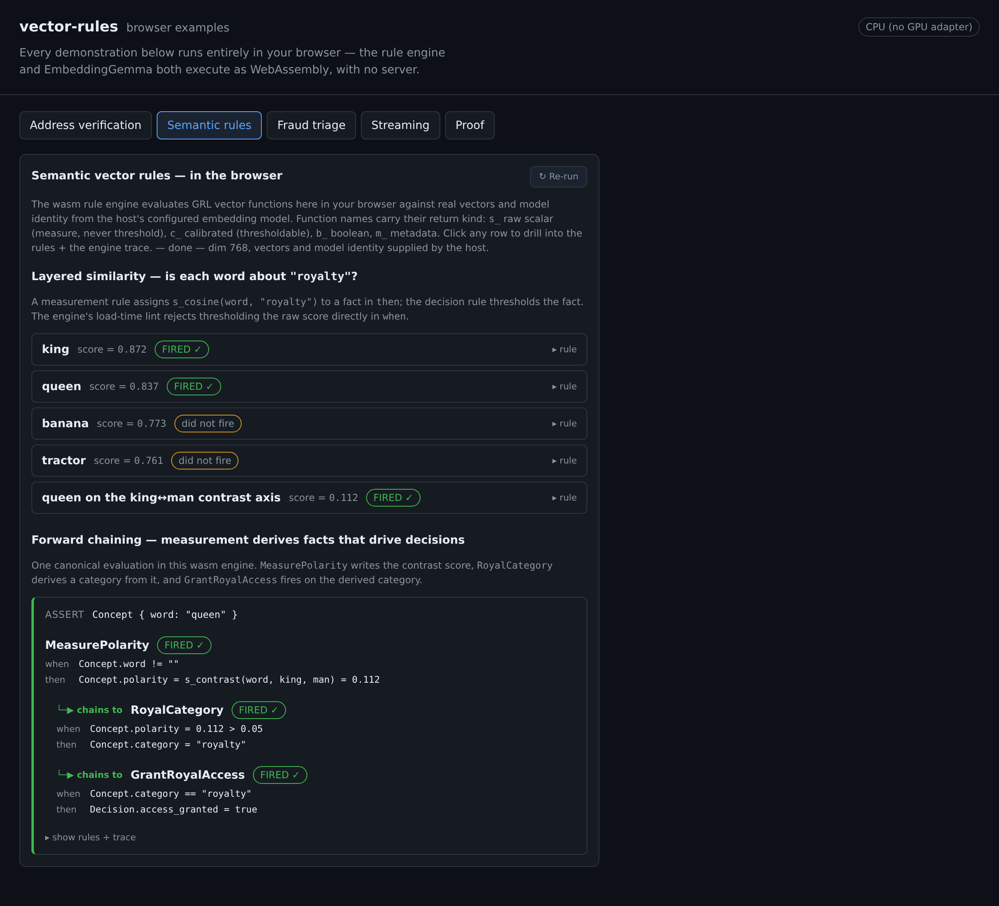
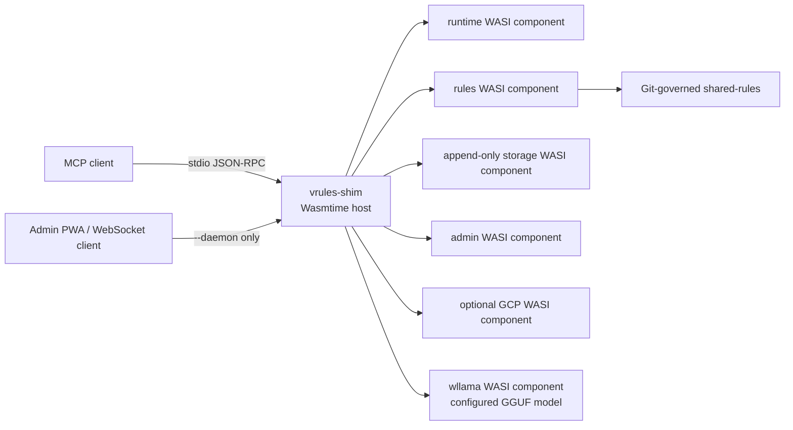
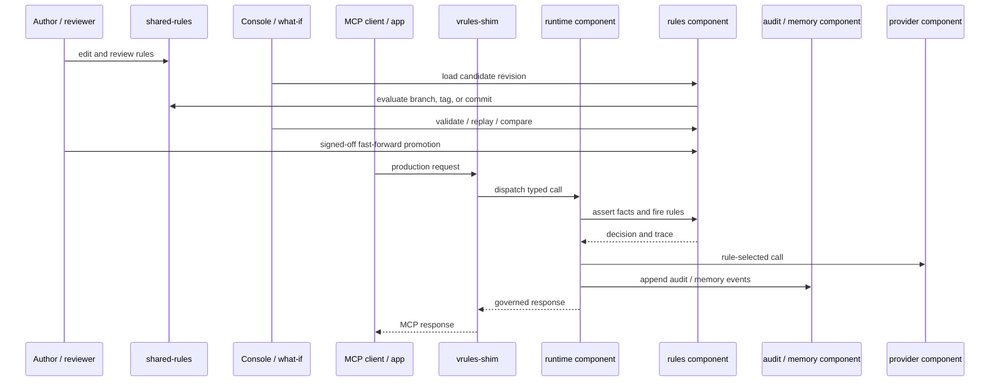

# vector-rules

**vector-rules defines an effective production role for LLMs while exposing the
power of embeddings to every layer of the technology stack.**

A deterministic, local-first policy engine for AI agents and MCP: Git-governed
guardrails, audited organizational memory, pluggable GGUF embeddings, and
portable WASM components in Rust.

LLMs are good at interpreting language, generating candidates, and explaining
complex information. They are not, by themselves, a reviewable source of
production policy. vector-rules puts a deterministic, GitOps-managed rule layer
between fuzzy inputs and operational actions so behavior can be tested, traced,
audited, replayed, and rolled back.

The project is fully open source, vendor-neutral, local-first, and embeddable.
The same rule semantics can govern an MCP component host, run inside a Rust
application, evaluate stateful streams, and power browser-side what-if analysis
through WebAssembly. Organizations keep their policy in git and can move it
across models, clients, and deployment environments without depending on a
proprietary control plane.

## Vision

AI-linked systems need both probabilistic interpretation and deterministic
control. vector-rules gives each one a clear responsibility:

1. **Models and embeddings interpret meaning.** They classify language, surface
   semantic relationships, retrieve relevant context, and help people work with
   policy.
2. **Rules decide production behavior.** Explicit conditions combine semantic
   evidence with request context, prior facts, organizational policy, and
   application state.
3. **Git governs change.** Rules move through normal review, testing, promotion,
   and rollback workflows.
4. **Traces and audit preserve accountability.** Decisions record the rules
   revision and evidence that produced them.

This division makes embeddings useful beyond a vector database or an LLM prompt.
Semantic similarity becomes evidence inside a deterministic rule network, where
it can gate conditions, derive facts, select tools, route requests, and control
memory recall.

### Operating principles

- **Deterministic production behavior.** `vrules-core` evaluates GRL through the
  canonical `RustRuleEngine` rather than an opaque reasoning loop. Forward
  evaluation returns execution traces; backward chaining can prove a goal and
  return its proof tree.
- **Governed organizational memory.** Embeddings are canonicalized,
  content-addressed, cached, and reused. Recall can be controlled by policy and
  recorded with provenance instead of existing only as transient prompt
  context.
- **One policy surface across runtimes.** The same GRL rules drive MCP tool
  exposure, request routing, embedded application behavior, sequential stream
  processing, and browser what-if analysis.
- **GitOps governance.** Every deployed decision can be tied to the exact rules
  commit that produced it, using whatever review and promotion controls an
  organization already trusts.
- **Open, composable infrastructure.** Teams can adopt the core library, browser
  package, component runtime, canonicalizer, or embedding cache independently
  and can register native Rust functions without coupling rule semantics to a
  transport or model vendor.

### The role of LLMs

vector-rules is not anti-LLM; it gives LLMs a bounded role that plays to their
strengths. An LLM can translate policy intent into candidate rules, propose
edge-case facts, explain diffs and traces, summarize audit history, and prepare
rollout notes. Schema validation, GRL parsing, engine firing, stream state,
proof, pinned rule revisions, and audit records remain the reviewable source of
runtime truth.

## From input to decision

A complete vector-rules decision path can use the following stages:

1. A host turns a request, message, event, or record into facts.
2. When applicable, registered canonical functions such as `s_canon_match` and
   `m_canon_label` normalize recurring variants, identify structural
   near-duplicates, and stabilize keys.
3. When meaning is needed, registered vector functions such as `s_cosine`,
   `s_contrast`, and the artifact-backed `c_project` / `b_member` resolve
   semantic evidence through the embedding layer. Content-addressed caches
   avoid recomputing the same embeddings.
4. `RustRuleEngine` combines those results with ordinary facts and state, then
   fires matching rules and forward-chains over derived facts.
5. Rules produce an explicit decision: expose a tool, select a provider, recall
   memory, route a request, write a value, or update stream state.
6. The host records the decision, trace, active rules revision, and relevant
   model or canonicalizer identity.

This creates a cheap deterministic pre-tier for common inputs while preserving
semantic reasoning for cases that need it. Vector search is not bolted onto the
side of the engine: canonical and vector expressions participate directly in
rule evaluation.

### Embeddings inside deterministic rules

GRL calls vector operations as ordinary registered functions, so embedding
measurements participate in the same condition evaluation as scalar facts. The
browser console runs the same evaluator through `vrules-wasm` and obtains real
vectors from the configured embedding component through the daemon RPC surface.

Function names carry their return kind, and the engine lints loaded rules
against declared function metadata, so misuse fails at load with a legible
error instead of skewing a decision at runtime:

| Prefix | Kind | May appear in `when` as |
|---|---|---|
| `s_` | raw scalar (geometry measurement) | nothing — assign to a fact in `then`, or use a `c_` form |
| `c_` | calibrated / decision-scale scalar | any comparison (`c_project(...) >= 90.0`) |
| `b_` | boolean | `== true` / `== false` / `test(...)` |
| `m_` | metadata (label, identifier) | equality and string operators |

The prefix describes how a result may be used; the function describes the
embedding operation. The built-in vector surface is:

| Function | What it does | Result and rule use |
|---|---|---|
| `s_cosine(left, right)` | Embeds two texts and measures cosine similarity. | Raw similarity; assign it to a fact in `then`. |
| `s_dot(left, right)` | Embeds two texts and takes their dot product without normalizing in the function. | Raw scalar that preserves any vector-magnitude signal; assign it to a fact in `then`. |
| `s_contrast(candidate, positive, negative)` | Computes `cos(candidate, positive) - cos(candidate, negative)` so shared topic meaning cancels and the semantic contrast remains. | Raw directional evidence; assign it to a fact in `then`. |
| `s_project(text, axis)` | Projects text onto a named axis fitted from positive and negative exemplar sets. | Raw axis position; assign it to a fact in `then`. |
| `c_project(text, axis)` | Projects text onto a calibrated axis and ranks the result against its reference window. | Percentile in `[0, 100]`; compare it directly in `when`. |
| `s_depth(text, region)` | Measures graded depth in a named region fitted around an exemplar cloud (`1.0` at the fitted boundary; smaller is deeper inside). | Raw region evidence; assign it to a fact in `then`. |
| `b_member(text, region)` | Tests the same fitted region at its coverage threshold. | Boolean; test it directly in `when`. |

Pairwise functions accept fact values or literal text. Artifact-backed
functions refer to a stable policy concept by name: an axis represents a
semantic direction such as routine-to-urgent, while a region represents a
cluster such as known business-email-compromise phrasing. The bridge
canonicalizes every text argument before embedding it.

Raw measurements support forward chaining without making an uncalibrated model
score look like a universal policy threshold. A measurement rule records the
evidence as a fact; a later rule combines that fact with ordinary conditions.
Calibrated and boolean artifact functions can participate in a decision
directly:

```grl
rule "MeasureSemanticEvidence" no-loop {
    when
        Payment.text != ""
    then
        Payment.urgency_contrast =
            s_contrast(Payment.text, "urgent and pressured", "routine and flexible");
        Payment.bec_depth = s_depth(Payment.text, "bec_phrasing_v1");
}

rule "HoldHighRiskRequest" salience 100 no-loop {
    when
        c_project(Payment.text, "urgency_pressure_v1") >= 90.0 &&
        b_member(Payment.text, "bec_phrasing_v1") == true &&
        Payment.new_payee == true &&
        Payment.amount >= 10000.0
    then
        Decision.action = "hold";
}
```

Axes, calibration windows, and regions are **named artifacts** fitted offline
(or in the browser) from exemplar sets. Each artifact records its provenance —
model, dimension, task prefix, exemplar-set version — and registration
validates that provenance against the active embedder, so an axis fitted
against one model can never silently score vectors from another.

The reference embedding component:

- loads a configured embedding-capable GGUF model directly;
- defaults to EmbeddingGemma in the release manifest;
- runs CPU-only, single-threaded wllama inference with SIMD128;
- returns L2-normalized vectors;
- reports the model SHA-256 through the typed ABI; and
- stamps vector events so searches never mix model revisions.

Use another compatible GGUF without rebuilding vector-rules:

```sh
vrules-shim --embedding-model /path/to/model.gguf
vrules-shim --embedding-model /path/to/model.gguf \
  --embedding-model-name "Organization Embeddings"
```

The host hashes the selected file, mounts its directory read-only into the
embedding component, and uses the digest, model name, and output dimension as
the cache identity. Persistent deployments can set `model_path`, `model`,
`model_sha256`, and the `/models` preopen in `vrules-components.json`. Models
without pooling metadata can set `pooling` to `mean`, `cls`, or `last`.

The standalone [`apps/examples`](apps/examples) app demonstrates layered semantic
similarity, contrast axes, fraud triage over fitted geometry artifacts, and
forward chaining from semantic evidence into deterministic facts — each running
entirely in the browser, embeddings on WebGPU or CPU. The
[browser examples gallery](docs/EXAMPLES.md) walks through every capability.



### What one policy layer can govern

| Use case | How vector-rules applies |
|---|---|
| **Agent and MCP mediation** | The runtime and rules components use connection and request facts to expose allowed tools, choose providers, and audit execution. |
| **Organizational memory** | Append-only storage, `em-log-n`, and `vrules-canon` provide model-aware vectors, policy-controlled recall, and searchable provenance. |
| **Reference business workflow** | Address verification proves that generic rules can combine native functions, embeddings, indexes, and organizational policy without making the address domain part of the framework. |
| **Application decisions** | Rust hosts parse GRL into `Ruleset` and evaluate structured `Facts` through `RustRuleEngine`. |
| **Streaming workloads** | The upstream synchronous `StreamProcessor` provides one-event/one-result processing with windows, watermarks, joins, state, and the optional upstream Redis-backed `StateStore`. |
| **Browser analysis** | `vrules-wasm` runs GRL validation, forward evaluation, reference workflows, and backward proof with native Rust semantics. |
| **Policy authoring and review** | `shared-rules` keeps reusable GRL packs and shared fact schemas in git. |

## Architecture

`vrules-shim` is the only native runtime executable. It hosts independently
replaceable WebAssembly components with Wasmtime and grants each guest only its
configured filesystem and HTTP capabilities.



The default mode is MCP over stdin/stdout:

```sh
vrules-shim
```

The optional daemon mode adds the admin PWA, JSON RPC, and MCP WebSocket
surfaces:

```sh
vrules-shim --daemon
vrules-shim --daemon --bind 127.0.0.1:8765
```

The component manifest is the deployment boundary: it selects implementations,
configuration, filesystem preopens, and HTTP allowlists without adding private
component IPC protocols. `wit/vrules.wit` remains backend-neutral.

### Engine compatibility

vector-rules uses rust-rule-engine as its engine of record. The fork stays
consistent with the originating project wherever possible so upstream parser,
runtime, and evaluator improvements can roll forward without a translation
layer. General engine fixes remain upstream-compatible fork changes; vector,
canonicalization, address, MCP, and product behavior use the engine's existing
extension APIs. The core design records the required deviation policy in
[`crates/vrules-core/docs/DESIGN.md`](crates/vrules-core/docs/DESIGN.md).

### GitOps and runtime lifecycle



Candidate rules can be tested in the browser, reviewed and promoted through git,
then executed by the same native rule kernel in the rules component. Forward
traces and backward proof explain decisions without asking a model to reconstruct
the reasoning afterward.

## Components

| Component | Responsibility |
|---|---|
| [`vrules-shim`](crates/vrules-shim) | Native Wasmtime host, MCP stdio/WebSocket transport, admin HTTP surface, component capabilities, and model overrides |
| `vrules-runtime-component` | MCP protocol, rule-driven tool exposure and routing, audit, cache, and memory tools |
| `vrules-rules-component` | GRL loading, canonical forward evaluation, validation, proof, Git revisions, diff, comparison, and fast-forward promotion |
| `vrules-storage-component` | Append-only audit, memory, and cache segments with model-revision-aware vector search |
| `vrules-admin-component` | Admin RPC, what-if, A/B evaluation, rules governance, memory inspection, and embedding diagnostics |
| `vrules-gcp-component` | Optional Vertex/Gemini provider with guest-owned ADC and credentials |
| `vrules-embedding-wllama` | Configurable GGUF embedding inference through pinned wllama/llama.cpp; EmbeddingGemma is the default model |

`release/vrules-components.json` declares component paths, configuration,
preopens, HTTP allowlists, and the admin plugin. Components can be replaced
without changing the native executable or the shared WIT contract.

## Rules, memory, and governance

`shared-rules/` contains reusable rule sets and schemas. The rules component
reads the active working tree and can also evaluate Git branches, tags, or
commit IDs. The admin surface supports revision-aware listing, diff, comparison,
what-if evaluation, A/B runs, and promotion with explicit sign-off and
fast-forward enforcement.

Updates and deletes in memory are appended as new events. Audit and memory
history remain reconstructable, and vector events carry model identity so
recall never crosses incompatible model revisions.

## Reference implementation: address verification

Address verification is deliberately a **reference implementation**, not a
business domain built into the core framework. It proves that generic
vector-rules execution can combine unstructured and structured inputs, native
functions, canonicalization, embeddings, local indexes, reference evidence, and
editable organizational policy in one auditable rule flow.

The PWA runs the reference workflow through `vrules-wasm` with the same
structured facts and `shared-rules/address/*.grl` policy consumed by native
hosts. The fact and rule contracts are host-neutral so streaming and batch
adapters do not require separate business-rule implementations. Columnar
adapter work is tracked in [the roadmap](docs/ROADMAP.md).

Address-oriented crates and the co-located `vrules-core::address`
module support this executable reference workflow. They are not framework
semantics, required runtime components, or a commitment to make address
verification part of the generic core API. Example identities and fixtures stay
under the isolated console example.

## Core libraries and console

- [`vrules-core`](crates/vrules-core) provides `Ruleset`, `RuleEvaluator`,
  upstream synchronous streaming types, vector/canonical functions, execution
  statistics, and proof.
- [`vrules-wasm`](crates/vrules-wasm) exposes the same engine to browsers.
- [`vrules-canon`](crates/vrules-canon) provides deterministic
  canonicalization.
- [`em-log-n`](crates/em-log-n) provides latency-first searchable storage and
  embedding-cache primitives.
- [`em-log-n-wasm`](crates/em-log-n-wasm) provides the browser storage and
  vector-index shape over IndexedDB.
- [`apps/console`](apps/console) is the Svelte admin PWA embedded in daemon
  mode. Operational panels remain top-level; demonstrations use isolated routes
  under `#/examples/*`.

## Release package

Release archives contain one native shim, the WASI components, an editable
component manifest, a Git-initialized rules repository, and the verified default
model fetcher.

```sh
tar -xf vrules-<version>-<target>.tar.zst
cd vrules-<version>-<target>
VRULES_MODEL_DIR="$PWD/models" ./fetch-model.sh
./vrules-shim
```

The optional GCP component is packaged but absent from the default manifest.
Enable it only after supplying its Google Cloud project and credential
configuration.

## Build from source

Rust 1.94 and the WASI targets are pinned in `rust-toolchain.toml`. The native
workspace and Rust WASI guests build with:

```sh
cargo build --workspace \
  --exclude vrules-runtime-component \
  --exclude vrules-storage-component \
  --exclude vrules-rules-component \
  --exclude vrules-admin-component \
  --exclude vrules-gcp-component

cargo build --target wasm32-wasip2 \
  -p vrules-runtime-component \
  -p vrules-storage-component \
  -p vrules-rules-component \
  -p vrules-admin-component \
  -p vrules-gcp-component
```

The wllama component additionally requires wasi-sdk 33, `wit-bindgen-cli`
0.59.0, `wasm-tools` 1.253.0, and Wasmtime's Preview 1 reactor adapter:

```sh
./release/build-components.sh
./release/build.sh
```

The release build produces a package for the current host. Explicit target
triples use rootless `cross`. The committed console `dist/` is rebuilt from
`apps/console` with `npm run build`.

## Development checks

```sh
./scripts/ci-check.sh
```

Semantic integration paths use vectors produced by the configured embedding
model with validated model identity and dimensions. Pure rule tests do not
substitute hash-derived, random, zero, or synthetic embeddings.

## Repository layout

```text
apps/console/  Svelte/Vite admin and example PWA embedded by the native shim
components/    non-Rust WASI component sources
crates/        Rust workspace members and Rust WASI guests
shared-rules/  Git-governed GRL, schemas, and manifest
wit/           backend-neutral component interfaces
docs/          roadmap, positioning, and architecture documents
release/       component manifests, build scripts, and packaging
```

## Documentation

- [Browser examples gallery](docs/EXAMPLES.md)
- [Core design](crates/vrules-core/docs/DESIGN.md)
- [Feature coverage](crates/vrules-core/docs/FEATURE-COVERAGE.md)
- [Shared rule packs](shared-rules/README.md)
- [Product roadmap](docs/ROADMAP.md)
- [GPU tensor execution roadmap](docs/GPU-TENSOR-ROADMAP.md)
- [Competitive landscape](docs/COMPETITIVE-LANDSCAPE.md)
- [Contributing](CONTRIBUTING.md)

## License

Dual-licensed under [MIT](LICENSE-MIT) or [Apache-2.0](LICENSE-APACHE), at your
option.
