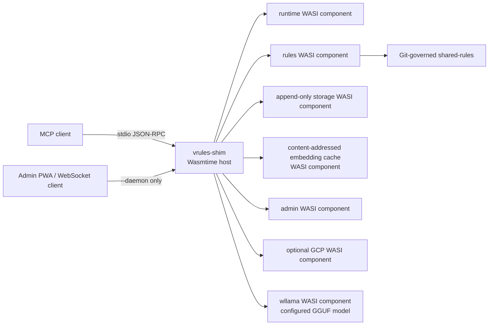
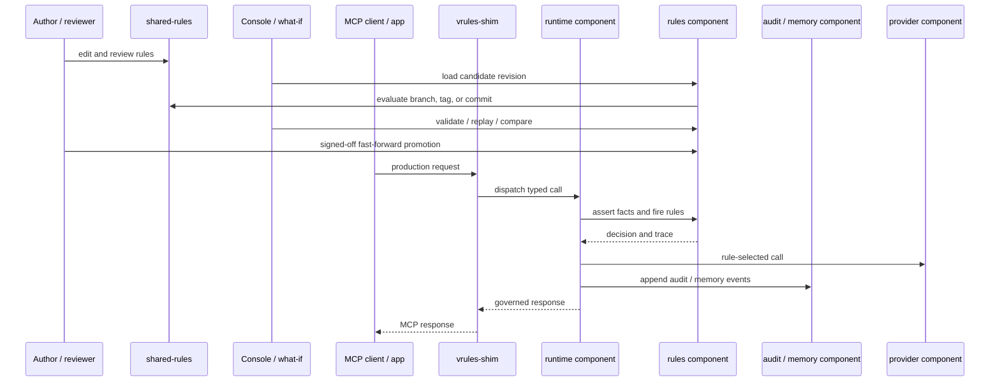

# Architecture

`vrules-shim` is the only native runtime executable. It hosts independently
replaceable WebAssembly components with Wasmtime and grants each guest only its
configured filesystem and HTTP capabilities.



The default mode is MCP over stdin/stdout:

```sh
vrules-shim
```

The optional daemon mode adds the admin PWA, JSON RPC, and MCP WebSocket
surfaces:

```sh
vrules-shim --daemon
vrules-shim --daemon --bind 127.0.0.1:8765
```

The component manifest is the deployment boundary: it selects implementations,
configuration, filesystem preopens, and HTTP allowlists without adding private
component IPC protocols. `wit/vrules.wit` remains backend-neutral.

## GitOps and runtime lifecycle

`shared-rules/` contains reusable rule sets and schemas. The rules component
reads the active working tree and can also evaluate Git branches, tags, or
commit IDs. The admin surface supports revision-aware listing, diff, comparison,
what-if evaluation, A/B runs, and promotion with explicit sign-off and
fast-forward enforcement.



Candidate rules can be tested in the browser, reviewed and promoted through git,
then executed by the same native rule kernel in the rules component. Forward
traces and backward proof explain decisions without asking a model to reconstruct
the reasoning afterward. Production traces and audit events retain the active
rule revision and decision evidence, tying runtime behavior back to the reviewed
policy source.

## Engine compatibility

vector-rules uses rust-rule-engine as its engine of record. The fork stays
consistent with the originating project wherever possible so upstream parser,
runtime, and evaluator improvements can roll forward without a translation
layer. General engine fixes remain upstream-compatible fork changes; vector,
canonicalization, address, MCP, and product behavior use the engine's existing
extension APIs. The core design records the required deviation policy in
[`crates/vrules-core/docs/DESIGN.md`](../crates/vrules-core/docs/DESIGN.md).

## Embedding cache and organizational memory

`vrules-cache` is a persistent embedding accelerator, not an
in-process memoization map. In a component deployment, embedding requests from
rule evaluation, `memory_write`, `memory_update`, `memory_search`, diagnostics,
and the `vrules-rest` routes all reach the real embedding model through the
same cache-through host path:

```text
local cache -> optional cloud tier -> embedding inference
     ^                                  |
     +----------- write-back -----------+
```

The content key combines the embedding-model revision, canonicalization
namespace, and text content. Identical text therefore reuses one vector within
the same model and canonicalization contract. Changing the model revision or
supplying a new canonicalization namespace selects a different keyspace instead
of serving stale coordinates. A local miss can pull from a configured cloud
tier via `VRULES_REST_URL`; only a miss at every tier runs inference. Newly
computed vectors are written locally and, when configured, back to the cloud
tier so other nodes can reuse them. Authentication for the cloud tier is
delegated to the configured `auth_plugin` (e.g. GCP, AWS) which generates
the appropriate `Authorization` header for each request.

Cache entries are append-only. Expiration appends an epoch change and makes
older generations non-live rather than deleting their records, so cache state
remains reconstructable. Cache failures are treated as misses on the embedding
path: they may cost an inference, but they do not change the resulting vector
or fail a rule or memory operation. The
[`vrules-rest` API](../crates/vrules-shim/README.md#vrules-rest) also exposes
immutable hash lookups, compute-on-miss requests, lossless f32 vector bodies,
strong ETags, write-up, expiration, and cache statistics.

Organizational memory and the embedding cache have separate responsibilities:

| | Organizational memory | Embedding cache |
|---|---|---|
| **Stores** | Governed facts, tags, source, supersession and tombstone events, vectors, and model identity | Derived vectors keyed by model, canonicalization namespace, and text |
| **Lifecycle** | Writes, corrections, and deletes append events so history remains auditable | Puts and epoch invalidations append records; entries can be regenerated |
| **Role** | Source of durable, policy-controlled recall | Shared accelerator for producing semantic evidence |

Updates and deletes append supersession and tombstone events rather than
altering prior memory. Audit and memory history therefore remain
reconstructable, and vector events carry model identity so recall never crosses
incompatible model revisions.

A memory write or update embeds the fact once and stores that vector with the
append-only event. A search embeds its query once and compares it with the
stored vectors; it does not re-embed the memory collection. Repeated facts,
queries, rule literals, and cross-agent requests reuse cached vectors, while
model identity prevents recall across incompatible vector spaces.

This removes duplicate GGUF forward passes from the common path, reducing
latency, CPU or GPU utilization, energy use, and the infrastructure cost of
organizational recall. A deployment using a compatible metered embedding
provider also avoids duplicate billable inference calls. Parent cache tiers
extend the same savings across processes and machines without turning the cache
into the memory system of record.
