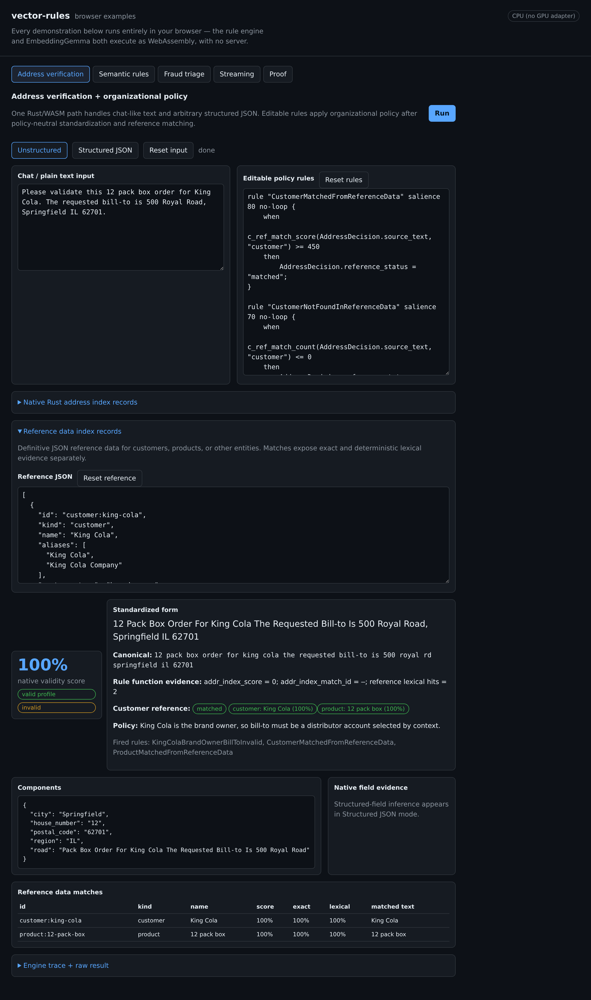
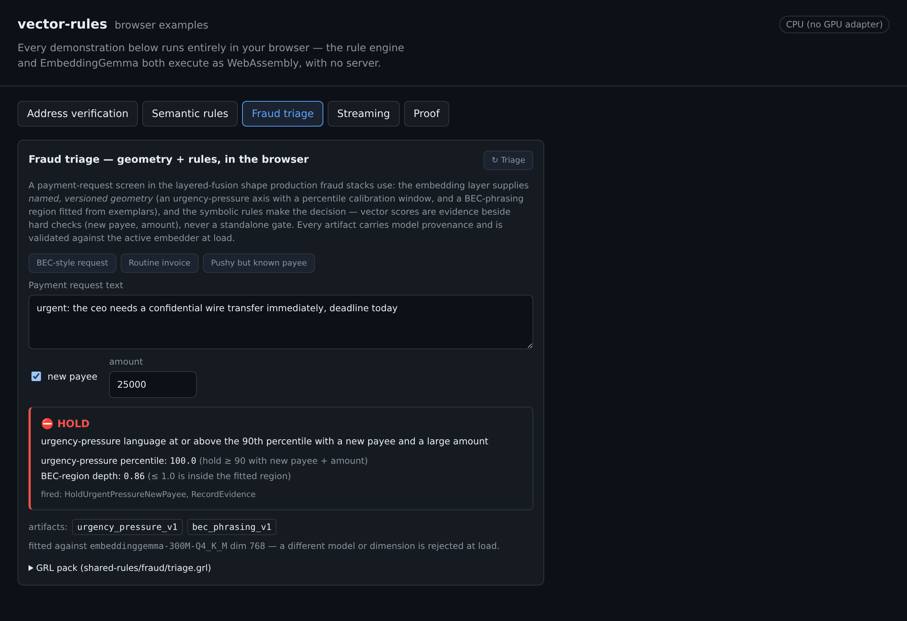
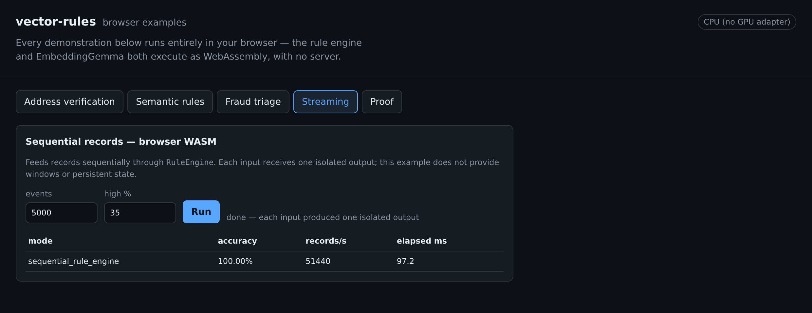
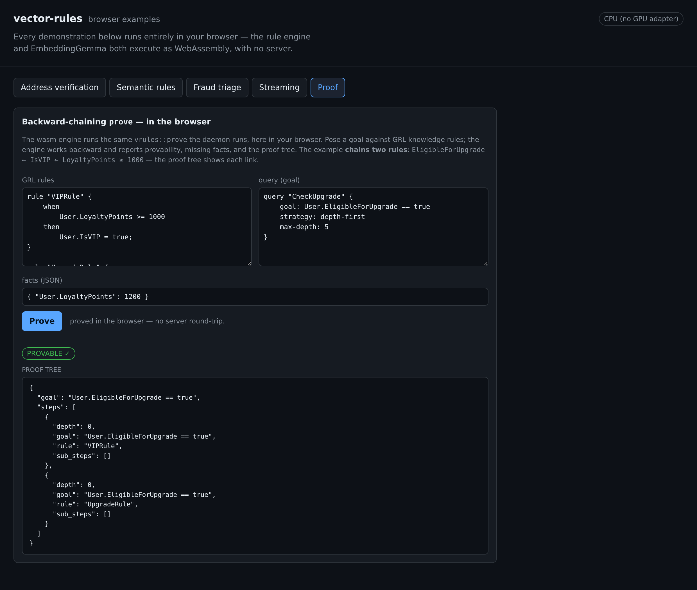

# Browser examples

The `apps/examples` app is a standalone, server-free build of the capability
demonstrations. Everything runs in the browser: the rule engine (`vrules-wasm`)
and EmbeddingGemma both execute as WebAssembly, with no daemon.

Embeddings are computed by wllama, which uses WebGPU when the browser exposes a
GPU adapter and falls back to CPU otherwise — the header badge reports the active
backend. A cache-through tier serves vectors from a static, content-addressed
cache seeded for the example corpora, so most demonstrations run without
downloading the model; free-form input falls back to in-browser inference.

## Address verification

One Rust/WASM path standardizes both chat-like text and arbitrary structured
JSON, matches the result against JSON reference data for customers and products,
and applies editable organizational policy as GRL rules. Native address
functions, canonicalization, reference lexical matching, and policy compose in a
single evaluation — the address domain is never baked into the framework. The
run reports a validity score, the canonical form, exact and lexical reference
evidence, fired rules, and the parsed components.

## Semantic rules

GRL vector functions evaluate over real EmbeddingGemma vectors. Function names
carry their return kind — `s_` raw scalar (a measurement, never thresholded),
`c_` calibrated (thresholdable), `b_` boolean, `m_` metadata — and the engine's
load-time lint rejects thresholding a raw score directly. A measurement rule
writes `s_cosine(word, "royalty")` into a fact; a decision rule thresholds the
fact; and forward chaining carries a contrast measurement through a derived
category into a final decision.

## Fraud triage

A payment-request screen in the layered-fusion shape production fraud stacks use.
The embedding layer supplies named, versioned geometry — an urgency-pressure axis
with a percentile calibration window and a BEC-phrasing region fitted from
exemplars — all fitted in the browser. The symbolic rules make the decision:
vector scores are evidence beside hard checks (new payee, amount), never a
standalone gate. Every artifact carries model provenance and is validated against
the active embedder at load.

## Streaming

Records feed sequentially through the `RuleEngine`; each input produces one
isolated output. The run reports throughput and accuracy for the sequential
rule-engine path.

## Proof

Backward-chaining `vrules::prove` runs in the browser — the same engine path the
daemon runs. A goal is posed against a GRL knowledge base and the engine works
backward, reporting provability, missing facts, and the proof tree. The example
chains two rules: `EligibleForUpgrade ← IsVIP ← LoyaltyPoints ≥ 1000`.

