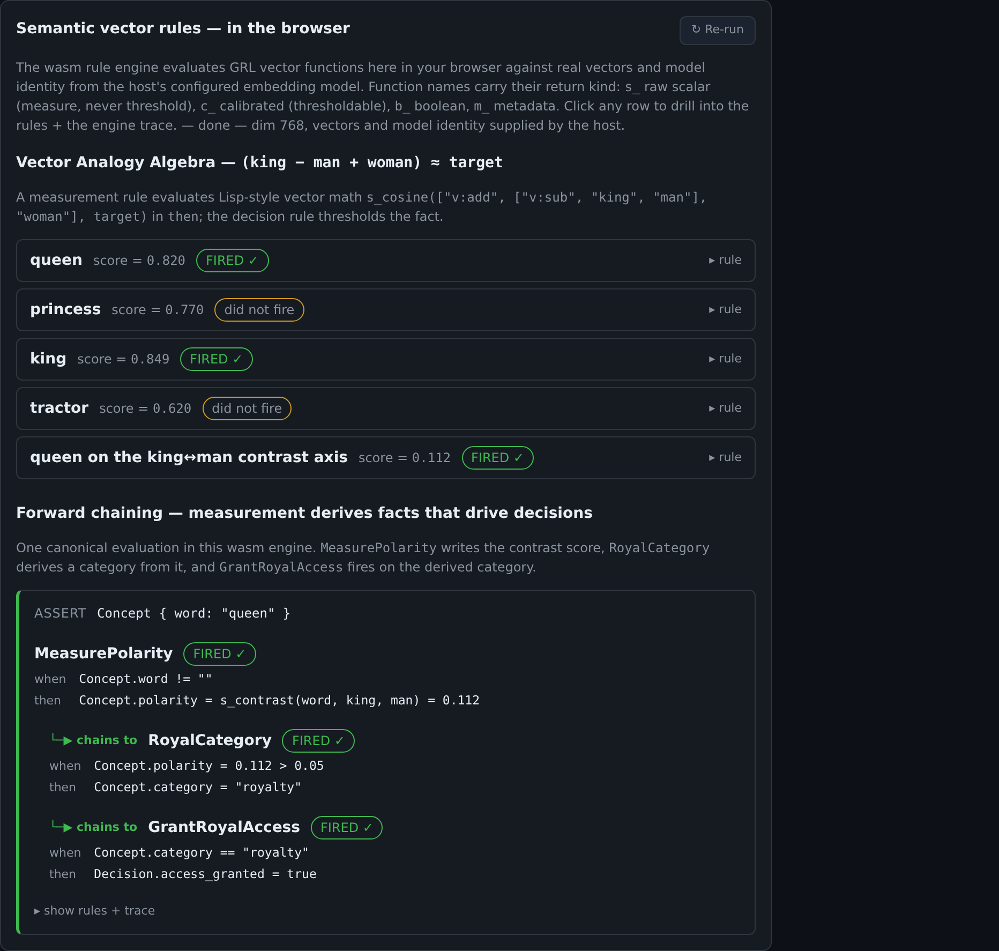
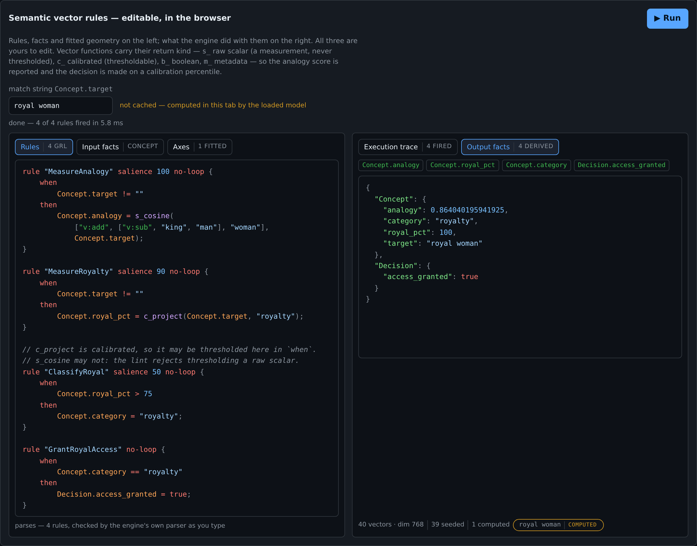

# Browser examples

**[Try them live →](https://ops-ping.github.io/vector-rules/)** — no install, no
sign-up, no server.

The `apps/examples` app is a standalone, server-free build of the capability
demonstrations. Everything runs in the browser: the rule engine (`vrules-wasm`)
and EmbeddingGemma both execute as WebAssembly, with no daemon.

Embeddings are computed by wllama, which uses WebGPU when the browser exposes a
GPU adapter and falls back to CPU otherwise — the header badge reports the active
backend. A cache-through tier serves vectors from a static, content-addressed
cache seeded for the example corpora, so every prepared demonstration runs
without downloading the model; free-form input falls back to in-browser
inference, streaming the pinned quantization from the CDN on first use.

The header states which of those is happening. Before any download it says the
prepared inputs come from the seeded cache and that editing text fetches the
model once (236 MB). During the fetch it shows a progress bar with transferred
bytes; on a return visit it reports that the model was already in the browser
rather than re-fetching it. Once loaded it names the running model, its digest,
and a running count of embeddings computed in that tab — so a claim that the real
model produced a given vector is checkable from the page itself.

The model is stored in OPFS, so the download happens once per browser.

## Verifying the examples

`npm run verify` builds the app, serves the built `dist/`, drives every enabled
example in headless Chrome, and captures the screenshots below. It fails the run
on any uncaught exception, console error, failed request, missing expected
selector, or a seeded-cache miss. Each target runs in its own browser context, so
a vector one target caches cannot change what the next one reports.

A run has to assert the values an example computes, not that it rendered
something. Counting elements is not verification: the Proof example rendered
NOT PROVABLE against an empty proof tree while its check — that an output
element existed — passed on every run, and it shipped that way. So the semantic
runs assert the derived numbers (`Concept.analogy`, `Concept.register_pct` and
the facts they chain into) for each input, and those numbers are corroborated
against `llama-server` measurements of the same model rather than against the
app itself. They also assert that nothing executes until Run is pressed, that
changing the match string changes which rules fire, and that the parameter and
the input-facts JSON stay two views of one value.

A prepared input that triggers a model download also fails the run. That guard
is what keeps `scripts/seed-cache.mjs` honest: the seed corpus mirrors string
constants in the example components, and drift there would silently cost every
visitor a 236 MB download instead of a cache hit. One target opts out — the
free-form semantic run, where downloading the model and computing a vector in
the browser is the thing being verified.

```
cd apps/examples
npm run verify        # build + drive + assert + capture
npm run screenshots   # capture against an already-running server
npm run seed          # re-seed the vector cache (needs llama-server + the GGUF)
npm run icons         # re-rasterize favicon.svg into the PNG/ICO fallbacks
```

The captured screenshots double as the fallback imagery in this document for
readers who cannot run the live site.

## Royal proclamations

An editable bench for vector reasoning, and the example the site opens on. A
message is scored on two independent calibrated axes — is a sovereign speaking,
and is the intent punitive — and the response falls out of the 2×2:

| | displeasure > 75 | displeasure ≤ 75 |
| --- | --- | --- |
| **voice > 60** | fall on your sword | acknowledge |
| **voice ≤ 60** | apologise | acknowledge |

Both axes separate cleanly on this model and their directions are near
orthogonal (cosine 0.136), so they are two questions rather than one signal
under two names. Measured through the bench: a displeased proclamation scores
93.75 on both and falls on its sword; the same anger in plain language scores 50
on voice and only apologises; a calm decree scores 75 on voice and 68.75 on
displeasure and is merely acknowledged.

Rules, asserted facts and fitted geometry are inputs on the left; what the engine
did with them is on the right. Each input section stays collapsed until it is
asked for, and closing them all gives the whole width back to the output. Every
fact field the rules feed into vector math becomes an editable parameter, read
straight out of the facts JSON so the two cannot drift apart. Nothing runs until
Run is pressed, and the trace, the value each rule derived, and the output facts
are read back from the engine'"'"'s own result — editing a rule changes what the
trace reports, because the trace is built from the source the engine parsed.

The split between measuring and deciding is what the return-kind vocabulary is
for. `s_cosine(["v:add", ["v:sub", "king", "man"], "woman"], Message.speaker)`
identifies the speaker through inline vector algebra and gates nothing; it
generalises to regnal names it was never shown — Queen Victoria 0.75, Elizabeth I
of England 0.72, against the mayor 0.65 and tractor 0.62. A raw cosine carries no
portable meaning, so the decisions are made on `c_project`, whose percentile
against a calibration window means the same thing on any model. Being calibrated,
`c_project` may be thresholded directly in `when`; the load-time lint rejects
doing that to a raw scalar.

Every rule carries `no-loop` and none carries `salience`. That is not decoration:
these conditions ask whether a field is non-empty, and firing a rule never makes
its own condition false, so without `no-loop` each rule re-fires every cycle to
the engine'"'"'s cap — 400 firings over 100 cycles instead of 4 over 2. Salience
changes nothing here and is therefore absent.



A message outside the seeded corpus takes the same path with nothing precomputed:
EmbeddingGemma is downloaded once, the vector is computed in the tab, and every
vector carries the tier that produced it.



## Not currently enabled

Address verification, Fraud triage, Streaming and Proof are built but hidden from
the app. Their runs assert that an element rendered, not what it says, so none of
them is known to be correct — that is exactly how Proof shipped broken. Each
returns to the nav once its run checks the values it computes, corroborated
independently of the app.

Proof is additionally blocked: backward chaining does not resolve a comparison
whose right-hand operand is another fact, so its knowledge base cannot prove its
goal. Forward chaining handles the same shape correctly; the asymmetry is in
upstream `rust-rule-engine`, not in anything vrules removed.

- [#1 — backward chaining does not resolve fact-to-fact comparisons](https://github.com/ops-ping/vector-rules/issues/1)
- [#2 — re-enable the remaining examples once their runs assert behaviour](https://github.com/ops-ping/vector-rules/issues/2)
